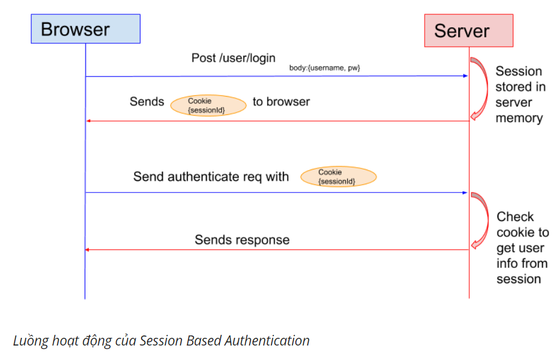
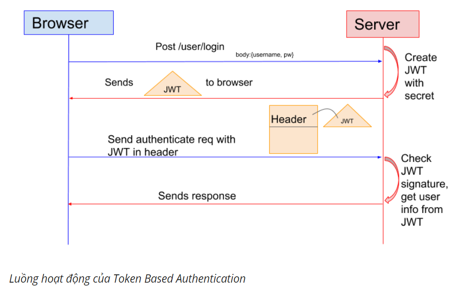
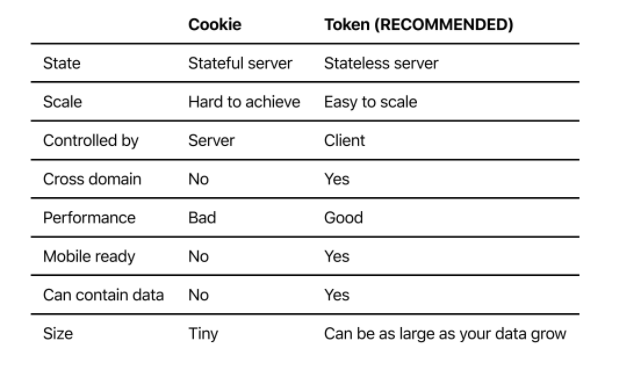

## SOLID PRINCIPLES

SOLID là năm nguyên lý cơ bản trong thiết kế phần mềm hướng đối tượng, giúp code trở nên dễ hiểu, linh động và dễ bảo trì hơn. Tác giả của SOLID là kỹ sư phần mềm nổi tiếng Robert C. Martin. Năm nguyên lý trong SOLID bao gồm:

- S: Single responsibility principle
- O: Open/closed principle
- L: Liskov substitution principle
- I: Interface segregation principle
- D: Dependency inversion principle

**Lưu ý:** tất cả ví dụ sử dụng Typescript

#### SINGLE RESPONSIBILITY PRINCIPLE

- Một class chỉ nên giữ 1 trách nhiệm duy nhất.
- Chỉ có thể sửa đổi class với 1 lý do duy nhất.

**EX:**

```sh
class Book {
    getTitle() {
        return "A Great Book";
    }

    getAuthor() {
        return "John Doe";
    }

    turnPage() {
        // pointer to next page
    }

    printCurrentPage() {
        return "current page content";
    }
}


```

Nếu chúng ta muốn user có thể truy cập vào 1 trang bất kỳ hoặc nội dung sách dưới nhiều định dạng. Chúng ta áp dụng nguyên lí, tạo ra 2 class.

```sh
class Pager {

    gotoPrevPage() {
        // pointer to prev page
    }

    gotoNextPage() {
        // pointer to next page
    }

    gotoPageByPageNumber(pagerNumber: number) {
        // pointer to specific page
    }
}
```

```sh
class Printer {
    printPageInHTML(pageContent: any) {
        // your logic
    }

    printPageInJSON(pageContent: any) {
        // your logic
    }

    printPageInXML(pageContent: any) {
        // your logic
    }

    printPageUnformatted(pageContent: any) {
        // your logic
    }
}
```

#### OPEN/CLOSED PRINCIPLE

- Có thể thoải mái mở rộng 1 class, nhưng không được sửa đổi bên trong class đó.

**EX:**
Phương thức getAuthor của lớp sách chỉ cung cấp tên tác gia. Nếu chúng ta cần có các chi tiết tác giả khác cho quản trị viên / quản lý / thủ thư và tên tác giả cho người dùng cuối ?

```sh
class Book {
    getAuthor() {
        return {
            name: 'Ashutosh Singh',
            age: 27,
            address: 'India'
        };
    }
}
```

Thay vì viết như trên, áp dụng nguyên tắc số 2

```sh
class Book {

    getAuthor() { }
}

class Book1 extends Book {

    constructor() {
        super();
    }

    getAuthor() {

        return {
            name: super.getAuthor(),
            age: ''
        }
    }
}

class Book2 extends Book {

    getAuthor() {

        return {
            name: super.getAuthor(),
            age: '',
            address: ''
        }
    }
}
```

### LISKOV SUBSTITUTION PRINCIPLE

- Trong một chương trình, các object của class con có thể thay thế class cha mà không làm thay đổi tính đúng đắn của chương trình.

**EX:**

```sh
class Bird {
    fly() {
        console.log('I can fly!');
    }
}

class Kingfisher extends Bird {

    constructor() {
        super()
    }

}

class Ostrich extends Bird {
    constructor() {
        super()
    }
}

let kingfisherBird: Bird = new Kingfisher();

let ostrichBird: Bird = new Ostrich();

kingfisherBird.fly(); // kingfisher can fly.

ostrichBird.fly()// ostrich can fly
```

Nghe thật vô lý, áp dụng nguyên tắc thứ 3:

```sh
class Bird {
    fly() {
        console.log('I can fly!');
    }
}

class Kingfisher extends Bird {

    constructor() {
        super()
    }

}

class Ostrich extends Bird {
    constructor() {
        super()
    }

    fly() {
        throw new Error("I don't fly rather I run");
    }

    run() {

    }
}

let kingfisherBird: Bird = new Kingfisher();

let ostrichBird: Bird = new Ostrich();

kingfisherBird.fly(); // kingfisher can fly.

ostrichBird.fly()// I don't fly rather I run
```

### INTERFACE SEGREGATION PRINCIPLE

- Thay vì dùng 1 interface lớn, ta nên tách thành nhiều interface nhỏ, với nhiều mục đích cụ thể.
- Hãy tưởng tượng chúng ta có 1 interface lớn, khoảng 100 methods. Việc implements sẽ khá cực khổ, ngoài ra còn có thể dư thừa vì 1 class không cần dùng hết 100 method. Khi tách interface ra thành nhiều interface nhỏ, gồm các method liên quan tới nhau, việc implement và quản lý sẽ dễ hơn.
  **EX:**

```sh
interface IBird {
    fly();
    run();
}

class Kingfisher implements IBird {
    fly() { }

    run() { }
}

class Ostrich implements IBird {
    fly() { }

    run() { }
}
```

Vì lớp Kingfisher cần implements run mà đối tượng của nó không cần sử dụng. Tương tự như vậy, Ostrich cần phải thực hiện bay mà đối tượng của nó không cần phải như vậy.

```sh
interface IKinshfisherBird {
    fly();
}

interface IOstrichBird {
    run();
}

class Kingfisher implements IKinshfisherBird {
    fly() { }
}

class Ostrich implements IOstrichBird {
    run() { }
}
```

### DEPENDENCY INVERSION PRINCIPLE

- Các module cấp cao không nên phụ thuộc vào các modules cấp thấp. Cả 2 nên phụ thuộc vào abstraction.
- Interface (abstraction) không nên phụ thuộc vào chi tiết, mà ngược lại.(Các class giao tiếp với nhau thông qua interface, không phải thông qua implementation.)

**EX:** Thiết lập chế độ xác thực tài khoản login của user

```sh
class Login {
    login(googleLogin: any) {
        // some code which will be used for google login.
    }
}
```

Giả sử, user đã thay đổi ý định và bây giờ muốn triển khai đăng nhập bằng các mạng xã hội khác. Ap dụng nguyên tắc thứ 5

```sh
interface ISocialLogin {
    login(options: any);
 }

class GoogleLogin implements ISocialLogin {
    login(googleLogin: any) {
        // some code which will be used for google login.
    }
}

class FBLogin implements ISocialLogin {
    login(fbLogin: any) {
        // some code which will be used for fb login.
    }
}
```

## COOKIE AND TOKEN BASED AUTHENTICATION

### COOKIE BASED AUTHENTICATION

Trong Session Based Authentication, server sẽ tạo một session cho người dùng sau khi người dùng đăng nhập. Session ID sẽ được lưu ở cookie trong trình duyệt của người dùng. Trong khi người dùng vẫn còn đăng nhập, cookie sẽ gửi tiếp cùng với những request tiếp theo. Server có thể so sánh session ID lưu trữ ở cookie với session được lưu trong bộ nhớ để xác minh thông tin người dùng và gửi phản hồi với trạng thái tương ứng.



### TOKEN BASED AUTHENTICATION

Một số trang website sử dụng JSON Web Token (JWT) thay thế cho việc xác thực bằng session. Trong Token Based Authentication, server tạo JWT một cách bí mật và gửi JWT tới client. Client lưu JWT (thường là local storage) và thêm JWT vào header với mọi request. Server sau đó sẽ xác thự JWT với mọi request từ client và trả về response.



### COMPARISION COOKIE VS TOKEN



## REFERENCE LINKS

[SOLID - 1](https://toidicodedao.com/2015/03/24/solid-la-gi-ap-dung-cac-nguyen-ly-solid-de-tro-thanh-lap-trinh-vien-code-cung/)

[SOLID - 2](https://medium.com/@erashu212/s-o-l-i-d-in-typescript-c0e4fe6c345a)

[COOKIE VS TOKKEN - 1](https://www.youtube.com/watch?v=c4CJ4Xjy_aQ)

[COOKIE VS TOKKEN - 2](https://viblo.asia/p/session-va-token-based-authentication-yMnKMNbNZ7P)
