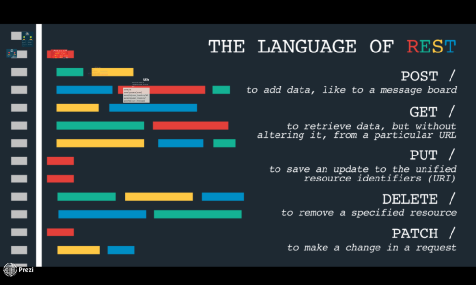
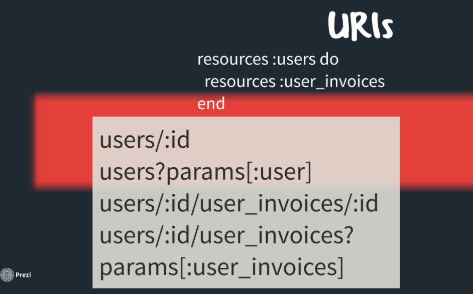
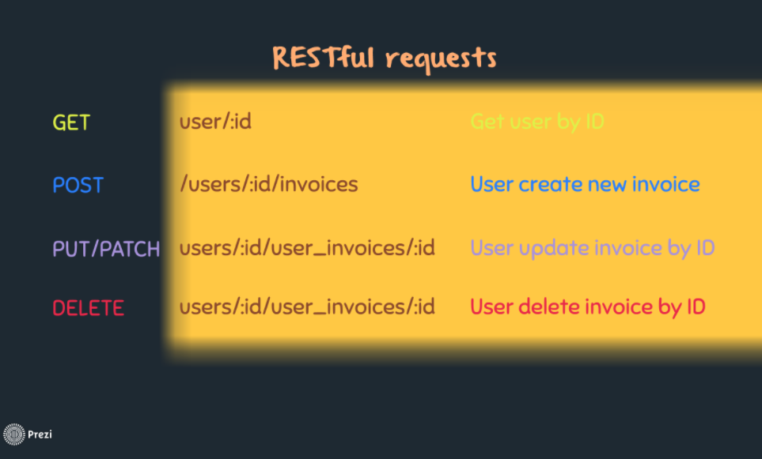

## RESTFUL API
### Định nghĩa
RESTful API là một tiêu chuẩn dùng trong việc thiết kế API cho các ứng dụng web (thiết kế Web services) để tiện cho việc quản lý các resource. Nó chú trọng vào tài nguyên hệ thống (tệp văn bản, ảnh, âm thanh, video, hoặc dữ liệu động…), bao gồm các trạng thái tài nguyên được định dạng và được truyền tải qua HTTP. Trong đó:
- API (Application Programming Interface) là một tập các quy tắc và cơ chế mà theo đó, một ứng dụng hay một thành phần sẽ tương tác với một ứng dụng hay thành phần khác. API có thể trả về dữ liệu mà bạn cần cho ứng dụng của mình ở những kiểu dữ liệu phổ biến như JSON hay XML.
- REST (REpresentational State Transfer) là một dạng chuyển đổi cấu trúc dữ liệu, một kiểu kiến trúc để viết API. Nó sử dụng phương thức HTTP đơn giản để tạo cho giao tiếp giữa các máy. Vì vậy, thay vì sử dụng một URL cho việc xử lý một số thông tin người dùng, REST gửi một yêu cầu HTTP như GET, POST, DELETE, vv đến một URL để xử lý dữ liệu.

- RESTful API là một tiêu chuẩn dùng trong việc thiết kế các API c-ho các ứng dụng web để quản lý các resource. RESTful là một trong những kiểu thiết kế API được sử dụng phổ biến ngày nay để cho các ứng dụng (web, mobile…) khác nhau giao tiếp với nhau.

- Chức năng quan trọng nhất của REST là quy định cách sử dụng các HTTP method (như GET, POST, PUT, DELETE…) và cách định dạng các URL cho ứng dụng web để quản các resource. RESTful không quy định logic code ứng dụng và không giới hạn bởi ngôn ngữ lập trình ứng dụng, bất kỳ ngôn ngữ hoặc framework nào cũng có thể sử dụng để thiết kế một RESTful API.
  
### Mô hình
Hệ thống REST giao tiếp với nhau bằng giao thức HTTP và chỉ hoạt động trên nền giao thức này, HTTP (một giao thức TCP/IP), theo tìm hiểu của mình thì REST không thể hoạt động trên giao thức UDP.

Một HTTP request sẽ gồm 2 phần:

- Giao thức dùng để xác định hàng động muốn thực hiện.



- Endpoint - trong hệ thống REST thì chính là URI của resource cần tác động vào.



- Một HTTP request đầy đủ để server có thể hiểu sau đó thực hiện request từ client sẽ gồm 2 phần trên.



### Ưu điểm của hệ thống REST
- Hiệu năng: các thành phần đảm bảo được việc giao tiếp theo đúng một quy ước giúp hệ thống có thể vận hành tốt hơn.
- Tính khả biến: với các hệ thống cần thay đổi các tài nguyên liên tục, sử dụng REST với việc tạo request đơn giản sẽ giúp mọi chuyển trở nên đơn giản hơn.
- Tính mở rộng: các hệ thống REST có khả năng mở rộng rất cao nhờ sự tách biệt giữa các thành phần và các quy ước giao tiếp được quy định sẵn.
- Tính linh hoạt: việc chuẩn hoá interface giúp hệ thống trở nên linh hoạt hơn, có thể sử dụng cho cho nhiều nền tảng khác nhau, mobile, web,...
- Trong sáng: trong giao tiếp giữa các thành phần, các request trở nên rất rõ ràng, dễ hiểu.
- Đơn giản: xây dựng rất đơn giản, ví dụ như việc khai báo resource trong rails đã giúp xây dựng các uri cho resource.
- Tính tin cậy: khó để xảy ra lỗi trong giao tiếp giữa các thành phần gây sụp đổ hệ thống.

## ROUTE GROUP
- Cách 1: Sử dụng express.Router() và app.use
```sh
// in router file
const express = require('express')
const app = express()
const router = express.Router()

// a middleware sub-stack shows request info for any type of HTTP request to the /user/:id path
router.use('/user/:id', function (req, res, next) {
  console.log('Request URL:', req.originalUrl)
  next()
}, function (req, res, next) {
  console.log('Request Type:', req.method)
  next()
})

// a middleware sub-stack that handles GET requests to the /user/:id path
router.get('/user/:id', function (req, res, next) {
  // if the user ID is 0, skip to the next router
  if (req.params.id === '0') next('route')
  // otherwise pass control to the next middleware function in this stack
  else next()
}, function (req, res, next) {
  // render a regular page
  res.render('regular')
})

// handler for the /user/:id path, which renders a special page
router.get('/user/:id', function (req, res, next) {
  console.log(req.params.id)
  res.render('special')
})

// mount the router on the app
app.use('/', router)
```

- Cách 2: Sử dụng express-group-routes
```sh
const app = require('express');
require('express-group-routes');
 
app.group("/api/v1", (router) => {
    router.get("/login", loginController.store); // /api/v1/login 
});
```

## LOOKUP VS POPULATE
### LOOKUP
- Lookup có thể join các collection lại với nhau được thì các collection đó phải có ít nhất 1 điểm chung. Tiếp theo đó bạn sử dụng cú pháp sau để join giữa 2 bảng:

```sh
db.collection(collection1).aggregate([
    { $lookup:
      {
        from: 'collection2',
        localField: 'colection2_id',
        foreignField: 'collection1_id',
        as: 'fieldName'
      }
    }
  ], function(err, res) {
    //handle
  });
}); 

Trong đó:
collection1 là collection mà bạn muốn thực thi truy vấn.
collection2 là collection mà bạn muốn join với collection1.
collection2_id là trường có điểm chung của collection2.
colleciton1_id là trường có điểm chung của collection1.
fieldName là key mà bạn muốn đặt cho trường chứa phép join. 
```

### POPULATE
- MongoDB có toán tử $ lookup. Mongoose có một giải pháp thay thế mạnh mẽ hơn được gọi là populate (), cho phép bạn tham khảo các tài liệu trong các collection khác.

Ex:

```sh
const mongoose = require('mongoose');
const Schema = mongoose.Schema;

const personSchema = Schema({
  _id: Schema.Types.ObjectId,
  name: String,
  age: Number,
  stories: [{ type: Schema.Types.ObjectId, ref: 'Story' }]
});

const storySchema = Schema({
  author: { type: Schema.Types.ObjectId, ref: 'Person' },
  title: String,
  fans: [{ type: Schema.Types.ObjectId, ref: 'Person' }]
});

const Story = mongoose.model('Story', storySchema);
const Person = mongoose.model('Person', personSchema);
```
Chúng ta đã tạo ra hai Model. Person model có trường stories được đặt thành một mảng ObjectIds. Tùy chọn ref là thứ cho Mongoose biết nên sử dụng mô hình nào trong quá trình, trong trường hợp của chúng ta là Story model. Tất cả các _id mà chúng tôi lưu trữ ở đây phải là các _id liệu từ Story model.

Không có gì đặc biệt cả, chúng ta chỉ tạo một Person và một Story. Và tìm tác giả của truyện có tựa là Casino Royale chúng ta có thể truy vấn như sau:

```sh
Story.
  findOne({ title: 'Casino Royale' }).
  populate('author').
  exec(function (err, story) {
    if (err) return handleError(err);
    console.log(story);
  });
```

## REFERENCE LINKS

[RESTFUL API - 1](https://topdev.vn/blog/restful-api-la-gi/)

[RESTFUL API - 2](https://kipalog.com/posts/REST-101---REST--RESTful-API)

[ROUTE GROUP - 1](https://www.youtube.com/watch?v=c4CJ4Xjy_aQ)

[ROUTE GROUP - 2](https://www.npmjs.com/package/express-group-routes)

[LOOKUP](https://docs.mongodb.com/manual/reference/operator/aggregation/lookup/)

[POPULATE](https://mongoosejs.com/docs/populate.html)
