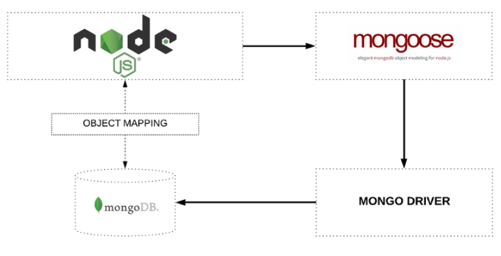
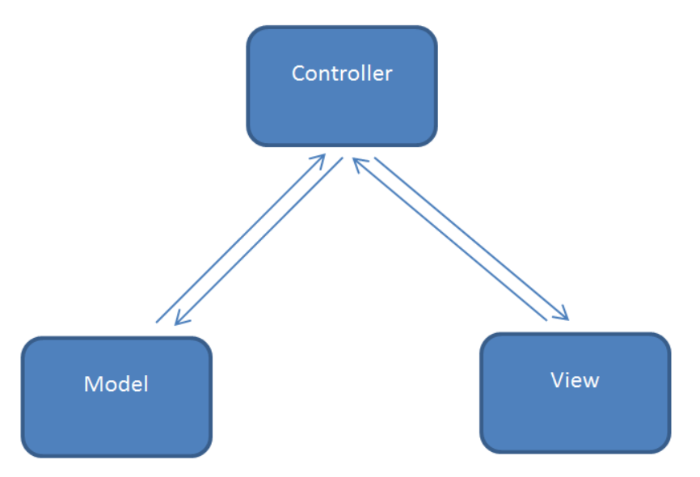

## MONGOOSE

### Định nghĩa

- Mongoose là một thư viện mô hình hóa đối tượng (Object Data Model - ODM) cho MongoDB và Node.js. Nó quản lý mối quan hệ giữa dữ liệu, cung cấp sự xác nhận giản đồ và được sử dụng để dịch giữa các đối tượng trong mã và biểu diễn các đối tượng trong MongoDB.
- Mongoose cung cấp một số lượng đáng kinh ngạc các chức năng cho việc tạo ra và làm việc với các schema.



### Định nghĩa schema cho Mongoose

Dối tượng user có chứa hai thuộc tính: firstName và lastName. Trong ví dụ sau, document đó thành một schema của Mongoose:

```sh
const userSchema = mongoose.Schema({
     firstName: String,
     lastName: String
 });
```

Đây là một schema rất cơ bản chỉ chứa hai đặc tính mà không có thuộc tính nào liên kết với nó. Hãy mở rộng ví dụ này bằng cách chuyển đổi các thuộc tính tên và họ thành các đối tượng con của thuộc tính name. Thuộc tính name sẽ bao gồm cả tên và họ.

```sh
const userSchema = mongoose.Schema({
     name: {
       firstName: String,
    lastName: String
     },
     created: Date
 });
```

### Tạo và lưu những model của Mongoose

Khi các schema của User chứng minh tính linh hoạt của Mongoose, tiếp tục sử dụng các schema đó và lấy ra một model User từ chúng.

```sh
const User = mongoose.model('User', userSchema);
```

Một Model của Mongoose, khi được lưu lại, tạo một Document trong MongoDB với các thuộc tính như đã được định nghĩa từ schema mà nó bắt nguồn.

## MVC CONCEPTS

### Mô hình MVC là gì?

- MVC là từ viết tắt của 'Model View Controller'. Nó đại diện cho các nhà phát triển kiến ​​trúc áp dụng khi xây dựng các ứng dụng. Với kiến ​​trúc MVC, chúng ta xem xét cấu trúc ứng dụng liên quan đến cách luồng dữ liệu của ứng dụng của chúng ta hoạt động như thế nào.

- Dễ hiểu hơn, nó là mô hình phân bố source code thành 3 phần, mỗi thành phần có một nhiệm vụ riêng biệt và độc lập với các thành phần khác.



### Các thành phần trong mô hình MVC

Mô hình MVC được chia làm 3 lớp xử lý gồm Model – View – Controller :

- **Model** : là nơi chứa những nghiệp vụ tương tác với dữ liệu hoặc hệ quản trị cơ sở dữ liệu (mysql, mssql… ); nó sẽ bao gồm các class/function xử lý nhiều nghiệp vụ như kết nối database, truy vấn dữ liệu, thêm – xóa – sửa dữ liệu…
- **View** : là nới chứa những giao diện như một nút bấm, khung nhập, menu, hình ảnh… nó đảm nhiệm nhiệm vụ hiển thị dữ liệu và giúp người dùng tương tác với hệ thống.
- **Controller** : là nới tiếp nhận những yêu cầu xử lý được gửi từ người dùng, nó sẽ gồm những class/ function xử lý nhiều nghiệp vụ logic giúp lấy đúng dữ liệu thông tin cần thiết nhờ các nghiệp vụ lớp Model cung cấp và hiển thị dữ liệu đó ra cho người dùng nhờ lớp View.

### Sự tương tác giữa các thành phần

- **Controller** tương tác với qua lại với **View**.
- **Controller** tương tác qua lại với **Model**.
- **Model** và **View** không có sự tương tác với nhau mà nó tương tác với nhau thông qua **Controller**.

## MONGODB ADVANCED

### INDEX

#### Index trong MongoDB là gì?

- Cải thiện việc thực thi truy vấn MongoDB.
- Không có index, toàn bộ collection phải được quét (COLLSCAN).
- Index lưu trữ các giá trị trường được sắp xếp.
- Cấu trúc dữ liệu index B-Tree.
- Index \_id mặc định: {\_id: 1} là index mặc định trong mỗi bộ sưu tập MongoDB, tên của index đó là \_id, index \_id mặc định là duy nhất.

```sh
 {
   "v": 2,
   "key": {
      _id: 1
   },
   "name": "_id_",
   "ns": "myDb.persons"
}
```

#### Các thao tác với index

**Create new index:** db.collection.createIndex(keys, options, commitQuorum)

```sh
db.products.createIndex({ "category": 1 })
db.products.createIndex({ "category": 1, "item": 1 })
```

**Delete index:**

- Xóa 1 index: db.collection.dropIndex({fieldName: 1})
- Xóa tất cả index: db.collection.dropIndexes()

Ngoài ra còn có **compound index, TTL, text index,** ...

### AGGREGATE

#### AGGREGATE trong MongoDB là gì?

Documents trong quá trình tổng hợp chuyển qua các giai đoạn. Đầu ra của giai đoạn trước là đầu vào của giai đoạn sau

```sh
db.<collection>.aggrerate([
   <stage1>,
   <stage2>,
   ...
   <stageN>
   ])
```

#### AGGREGATION STAGES

- Mỗi stage bắt đầu từ toán tử: { \$stageOperator: {} }

- **Ex:** $match, $group, $project, $sort, $count, $limit, $skip, \$out

**MATCH STAGE**

- Các collections phù hợp bằng cách sử dụng truy vấn.
- **Syntax:** { \$match: { query }}

```sh
{ $match: {city: "New York"}}
{ $match: {age: {$gt: 25 } } }
{ $match: {$and: [ {gender: "female"}, {age: {$ge: 25 }} ]}}
```

**GROUP STAGE**

- Nhóm các collections phù hợp bằng cách sử dụng truy vấn.
- **Syntax:** { \$group: {\_id: expression, field1}: {accumulator1: expression1 }, ... }}

```sh
{ $group: {_id: "$age"}}
{ $group: {_id: {age: "$age", gender: "$gender"}}} // Group by multiple fields
{ "_id": { age: 27, gender: male }},
{ "_id": { age: 37, gender: female}},
{ "_id": { age: 23, gender: male }}
```

**COUNT STAGE**

- Đếm số lượng document đầu vào.
- **Syntax:** {\$count: "title"}

**SORT STAGE**

- Sắp xếp document đầu vào theo filed nhất định.
- **Syntax:** {\$sort: {field1 <-1|1>, field2: < -1|1 > ...}}

```sh
{ $sort: {score: -1}}
{ $sort: {age: 1, country: 1}}
```

**PROJECT STAGE**

- Loại trừ hoặc thêm (các) trường mới.
- **Syntax:** { \$project: {field1: <1>, field2: <0>, newField1: expression ... }}

```sh
{ $project: {name: 1, _id: 0, "company.title": 1}}
   db.persons.aggregate([
      { $project: {
         _id: 0,
         name: 1,
         infor: {
            eyes: "$eyeColor",
            fruit: "$favoriteFruit",
            country: "$company.location.country"
         }}}])
```

**LIMIT STAGE**

- Xuất ra N tài liệu đầu tiên từ đầu vào.
- **Syntax:** ( $limit: number) (after $sort to produce topN results)

```sh
{$limit: 100}
```

**UNWIND STAGE**

- Tách từng document với mảng được chỉ định thành một số document - một document cho mỗi phần tử mảng.
- **Syntax:** { \$unwind: arrayReferenceExpression}

```sh
Ex: {$unwind: "$tags"}
```

**OUT STAGE:**

- Ghi các tài liệu kết quả vào bộ sưu tập MongoDB.
- Là giai đoạn cuối cùng trong đường dẫn, nó sẽ được tạo tự động.
- **Syntax:** { \$out: "outputCollectionName"}

```sh
db.persons.aggregate([
   { $group: {_id: {age: "$age", eyeColor: "$eyeColor"}}},
   { $out: "aggregationResults"}
])
```

**OPTIONS**
allowDiskUse: true

- Tất cả các giai đoạn tổng hợp có thể sử dụng tối đa 100 MB RAM.
- Máy chủ sẽ trả về lỗi nếu vượt quá giới hạn RAM.
- Tùy chọn sau sẽ cho phép MongoDB ghi dữ liệu các giai đoạn vào các tệp tạm thời.

```sh
db.persons.aggregate([], {allowDiskUse: true})
```

## REFERENCE LINKS

[MONGOOSE](https://code.tutsplus.com/vi/articles/an-introduction-to-mongoose-for-mongodb-and-nodejs--cms-29527)

[MVC](https://viblo.asia/p/doi-dieu-ve-mo-hinh-mvc-E375z0vJZGW)

[INDEX](https://docs.mongodb.com/manual/reference/method/db.collection.createIndex/)

[AGGREGATE](https://www.youtube.com/playlist?list=PLWkguCWKqN9OwcbdYm4nUIXnA2IoXX0LI)
